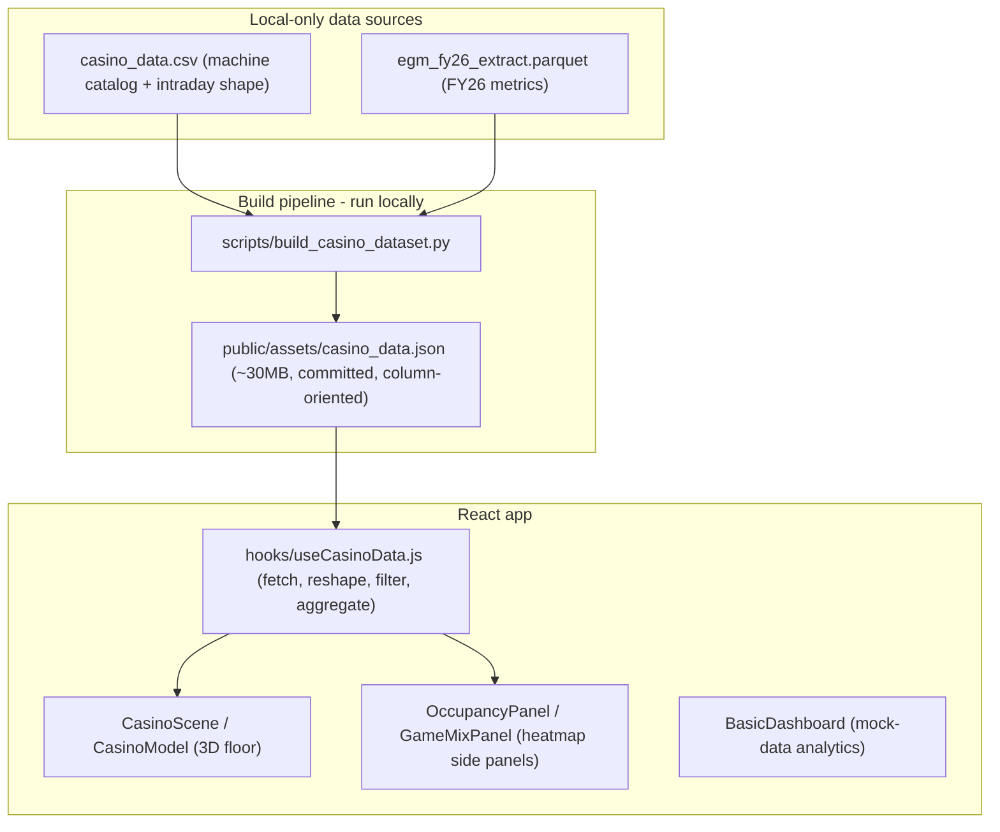

# Casino Analytics Studio — Full Project Context

> Single-file project briefing intended to be pasted into an LLM (GPT/Claude) for discussion.
> Reflects the current state of the codebase as of June 2026, including the DD/non-DD data
> model, real measured occupancy, the `weekEnding` filter, no-data handling, mean-based
> occupancy metrics, and the **Customer Demand tier lens** (the newest addition — see §8a
> and §11). Where this doc and `docs/PROJECT_STATUS.md` disagree, this file is newer.

---

## 1. What this project is

**Casino Analytics Studio** is an interactive casino-operations workbench. It pairs an
**interactive 3D casino floor** (React Three Fiber) with **analytics panels**. Analysts filter
the floor by zone, week, day, hour, machine type, game, and occupancy; the floor recolors
(heat map or occupancy) and side panels explain performance and occupancy drivers.

- **Production:** https://casino-floormap.vercel.app
- **Repo:** https://github.com/laioespinheira/CasinoAnalytics (production branch `master`)
- **Data:** Real FY26-derived metrics shipped as a pre-built JSON file (no live API). Some
  legacy analytics dashboards still use mock generators.

---

## 2. Tech stack and commands

| Layer | Choice |
|-------|--------|
| UI | React 18, Vite 7, Tailwind 4 (plus heavy inline styles) |
| 3D | Three.js `^0.178`, `@react-three/fiber` `^8`, `@react-three/drei` `^9` |
| GUI controls | `lil-gui` (lighting/color dev panel) |
| Data build | Python 3 + `pyarrow` (`scripts/build_casino_dataset.py`) |
| Hosting | Vercel (Git-connected, auto-deploy on push to `master`) |

```bash
npm install && npm run dev     # local dev (Vite; see vite.config.js for port)
npm run build:data             # regenerate casino_data.json (needs local CSV + parquet)
python scripts/build_customer_tier_data.py   # regenerate customer_tier_data.json (needs floorpulse_masked.parquet + CSV; no npm script yet)
npm run build                  # production bundle -> dist/
npm run lint                   # eslint (js,jsx), max-warnings 0
npm run deploy                 # CLI fallback: npx vercel --prod --yes
git push origin master         # primary deploy path (Vercel builds; does NOT run build:data)
```

Important: Vercel does **not** run the Python data builds. The committed `public/assets/*.json`
files (`casino_data.json` ~30 MB and `customer_tier_data.json`) are shipped as-is. Rebuild
locally and commit the JSON when source data changes. `vercel.json` pins the Vite framework
preset and sets a 1-year immutable `Cache-Control` on `/assets/*.json`; `.vercelignore` keeps
the parquet, CSV, `.bak`, notebooks, `scripts/`, `docs/`, and `photos/` out of the deploy.

---

## 3. Architecture and data flow



- **Runtime fetch:** `useCasinoData.js` fetches `/assets/casino_data.json`.
- **Join chain:** parquet `Location` = CSV `machineFullName` -> catalog `blender_id` -> 3D mesh
  object name in the GLB. So a row's `blender_id` is the name of the mesh it colors.
- **3D asset:** `public/models/casino_floor_map.glb` (~12 MB, committed).
- **Top-level views:** `App.jsx` switches `currentView` between `analytics` (dashboards) and
  `3d` (the floor). In 3D, `viewMode` is one of `overall`, `heatmap`, `comparison`, `time`.

---

## 4. Data model (current)

The JSON is **column-oriented** (`{ field: [v0, v1, ...] }`). The hook reshapes it into an
array of row objects, parses `turnover`/`stroke` to floats, and merges zones D/E/F into `Zone DD`.

### Two row classes (key concept)

Rows are distinguished by whether `date` is set:

- **DD rows** (`date` is a string like `"2026-01-15"`, `week_ending` set): real ratings data
  with full metrics. Have `occupancy` (float `[0,1]`), `win`, `avg_bet`, `dominant_tier`.
- **Non-DD rows** (`date === null`, `week_ending === null`): older weekday-averaged data for
  the rest of the floor. Have `weekday`, `hour`, `turnover`, `stroke`, `zone`, `location`,
  `machineType`, `game_type`; but `win`, `avg_bet`, `occupancy`, `dominant_tier` are `null`.

A "DD machine" is any machine with at least one DD row; a "non-DD machine" has only non-DD rows.

### Fields per row

| Field | Notes |
|-------|-------|
| `blender_id` | Machine id; also the 3D mesh name |
| `machineFullName` | Display name |
| `zone` | e.g. `Zone DD`, `Zone A`; D/E/F merged to `Zone DD` at load |
| `location` | Bank/table label within a zone |
| `machineType` | `eTGs`, `Tables`, `Classic`, `Round Banks`, ... |
| `game_type` | Single canonical game title (see August pin below) |
| `weekday` | Real field on every row (do NOT derive from date) |
| `hour` | Hour of day (number or `"H:00"` string) |
| `date` | DD only; `null` for non-DD |
| `week_ending` | DD only; `null` for non-DD |
| `turnover`, `stroke` | Float metrics (both classes) |
| `occupancy` | Measured fraction `[0,1]` = minutes seated / 60. DD only; `null` for non-DD |
| `win`, `avg_bet`, `dominant_tier` | DD only; `null` for non-DD |

### Occupancy semantics

- `occupancy` is a **real measured float**, not derived from turnover.
- `OCCUPANCY_THRESHOLD = 0.85` (exported from `useCasinoData.js`). Data-derived "knee" of the
  peak-hour occupancy distribution; ~22.7% of peak DD machine-hours run >= 0.85. Used to define
  "occupied / high demand / saturated".
- Per-machine occupancy across many filtered rows = **mean** of valid (non-null) values.

### August week-1 `game_type` pin (data build)

`build_casino_dataset.py` pins each machine to one canonical game: the highest-turnover title
during 2025-08-01..2025-08-07, so the UI shows a single game per machine instead of "multiple
titles this hour". Fallbacks: top FY game by turnover, then CSV `game_type`.

---

## 5. Filters

`App.filters` is the single source of truth, passed to both the 3D floor and the panels:

```js
{ zone, machineType: [], gameType, occupancy, dayOfWeek, hourOfDay, weekEnding }
```

- Default: `{ zone:'all', machineType:[], gameType:'all', occupancy:'vacant',
  dayOfWeek:'all', hourOfDay:'all', weekEnding:'all' }`.
- Entering heatmap mode sets defaults `hourOfDay:6, dayOfWeek:'Saturday', weekEnding:'all'`.
- `NavigationBar` has its own local filter state and emits changes via `onFilterChange`;
  `App.handleFilterChange` merges them (`setFilters(prev => ({ ...prev, ...newFilters }))`) so
  App-only fields survive. The Week Ending dropdown is derived from unique non-null
  `week_ending` values.

### Filter rules in `getFilteredData(filters)`

- `zone`, `machineType[]`, `gameType`, `dayOfWeek` (via `row.weekday`), `hourOfDay`: match both classes.
- `weekEnding`: a specific value matches `row.week_ending`, which **naturally excludes non-DD
  rows** (their `week_ending` is null). `'all'` includes everything.
- `occupancy`: `'all'` = no filter; `'occupied'` = `occupancy >= 0.85`; otherwise `< 0.85`.
  Rows with `null` occupancy (non-DD) are dropped whenever a specific occupancy filter is set.
- Results are cached in a small ref-based LRU (cap ~16 entries), keyed by the filter shape
  including `weekEnding`.

Note: most panel/aggregation helpers call `getFilteredData({ ...filters, occupancy: 'all' })`
and then apply a **DD-only guard** (`.filter(r => r.date != null)`) so panels never show
non-DD data. The heat map intentionally includes both classes.

---

## 6. `useCasinoData` API reference (current)

Hook: `src/hooks/useCasinoData.js`. Exports raw state plus memoized helper callbacks.

| Export | Purpose |
|--------|---------|
| `casinoData`, `loading`, `error` | Raw reshaped dataset + load state |
| `OCCUPANCY_THRESHOLD` (named export) | `0.85` constant, reused by 3D + cards |
| `getFilteredData(filters)` | Rows matching all filters (see rules above), cached |
| `getDataByBlenderId(id)` | First catalog row for a machine |
| `getHeatMapData(filters)` | Per-`blender_id` turnover + percentiles for heat coloring |
| `getDailyHeatMapData(filters)` | Day-level heat aggregation |
| `getZoneAggregates(filters)` | Per-zone rollups (DD-guarded) |
| `getBankAggregates(filters, zoneFilter?)` | Per-bank rollups (DD-guarded) |
| `getDDBankRanking(filters)` | Zone DD bank ranking by avg turnover |
| `getBankRankings(filters)` | Bank rank within zone (DD-guarded) |
| `getBankTrend(bankKey, filters)` | Hourly trend buckets for one bank |
| `getZoneOccupancy(zone, filters)` | Occupancy metrics (see below) |
| `getZoneGameMix(zone, filters)` | Games with `machineIds`, sorted by total turnover |
| `getPerformanceInsights(zone, filters)` | Banks, game families, pockets, verdict, drivers |
| `getMachineMetrics(blenderId, filters)` | Single-machine slice or a no-data sentinel |
| `getUniqueLocations(zone)`, `getMachinesByLocation(zone, location)` | Catalog lookups |

### `getZoneOccupancy` return shape (recently reworked to mean-based)

```js
{
  zone,
  totalMachines,        // distinct DD machines in the filtered slice
  saturatedMachines,    // machines whose mean occupancy >= 0.85
  occupiedMachines,     // == saturatedMachines (kept for backward-compat)
  avgOccupancy,         // mean of occupancy fractions across filtered rows (0..1 or null)
  pct,                  // headline = avgOccupancy * 100 (the fill rate, NOT a threshold count)
  occupancyDrivers,     // { topBanks, topGames, totalOccupied } from buildOccupancyDrivers
  byBreakdown: [        // per (bank, machineType)
    { bank, machineType, total /* distinct machines */, avgOccupancy, pct /* mean % */ }
  ]
}
```

### `getMachineMetrics` no-data sentinel

If a machine has zero rows in the current filter (after the DD-only guard), the helper returns
a truthy sentinel instead of stale `rows[0]` data:

```js
{ noData: true, blender_id, machineFullName, location, zone, machineType,
  game_type, gameType, activeFilters: { weekEnding, dayOfWeek, hourOfDay } }
```

It is truthy on purpose: callers use `getMachineMetrics(...) || fallback`, so `null` would
re-introduce stale fallback data. `MachineDetailCard` detects `noData` and renders a
"No data for this machine in the selected filters" state (with the active filters) instead of
metric tiles.

---

## 7. 3D floor coloring and interaction (`CasinoModel.jsx`)

Color constants:

- `MUTED_GRAY = '#374151'` — non-DD machines, and low-occupancy DD machines (binary mode).
- `NO_DATA_GRAY = '#9ca3af'` — DD machine that has data somewhere but **no rows in the current
  filter** (visually distinct from non-DD muted gray, and from the white-ish floor).
- Heat ramp: existing 5-tier `getHeatMapColor` driven by `getHeatLevel(value, percentiles)`.
- Occupancy gradient: blue `#3b82f6` -> orange `#f59e0b` -> red `#ef4444`, interpolated in
  **sRGB component space** (a custom helper, not `THREE.Color.lerp`, to avoid purple midpoints).

Coloring logic, unified across both views so "no data" reads the same:

- **Heatmap mode:** color by **mean turnover per machine-hour** (not sum) so DD machines with
  ~14 weeks of rows do not drown out non-DD weekday-averaged machines. Percentile breakpoints
  recompute over those means. Machines with no filtered rows: `NO_DATA_GRAY` if DD, `MUTED_GRAY`
  if non-DD.
- **Overall / occupancy mode:**
  - Specific hour selected -> binary: mean occupancy `>= 0.85` red, else `MUTED_GRAY`.
  - No specific hour -> continuous occupancy gradient (blue->orange->red) by mean occupancy.
  - Non-DD machines -> `MUTED_GRAY`; DD machines with no rows in filter -> `NO_DATA_GRAY`.

Interaction:

- **Non-DD machines are not clickable for detail.** Clicking shows a minimal `drei <Html>`
  tooltip with just name + zone; it does not open the detail card.
- **DD machines:** first click pins `MachineTooltip`; second click on the same machine opens
  `MachineDetailCard`. Clicking clears any bank-hover tooltip.
- Bank hover shows `BankHoverTooltip`; for non-DD banks (no DD coverage) it shows
  "Averaged data only" instead of "No data for the current filters".

---

## 8. Panels and views

- **Analytics dashboard** (`BasicDashboard.jsx` and friends): legacy view, partly mock data
  (`src/data/casinoMockData.js`, `src/utils/mockDataGenerator.js`).
- **3D heatmap right-drawer panels** (mutually exclusive, only in `viewMode === 'heatmap'`).
  Two toggle buttons in `NavigationBar` ("Insights", indigo; "Customer Demand", sky-blue) open
  them; opening one closes the other (`App.handleToggleInsightPanel` /
  `handleToggleCustomerDemandPanel`). Closing both clears `highlightTarget`.
  - **`InsightPanel.jsx`** <- `getPerformanceInsights` (+ `getZoneOccupancy` passed as
    `occupancy`). This is the **merged** performance+occupancy panel that replaced the old
    `OccupancyPanel` and `GameMixPanel` (both still in the tree but **no longer imported by
    `App.jsx`** — treat them as dead/legacy). Shows: area-snapshot hero (turnover, occupancy %,
    high-demand count), verdict, a generated "commercial readout" sentence, revenue-leading
    banks, product drivers (game families), "demand drivers" (busiest banks + most-played
    products from `occupancyDrivers`), and "revenue concentration" pockets. Selecting any row
    sets `highlightTarget`.
  - **`CustomerDemandPanel.jsx`** <- `useCustomerTierData.getCustomerDemandInsights` (see §8a).
    The Customer-Tier dropdown (heatmap mode only) drives `selectedTier`. Shows a tier snapshot
    hero, stat cards, commercial readout, demand hotspots, capacity constraints (flagged), and
    product drivers — all **allocated to the selected tier**. Selecting a tier or a row sets
    `highlightTarget` to dim non-matching machines on the floor.
- **Comparison mode** (`ComparisonPanel`, `FloorSummaryPanel`): exists; still partly mock data.

`highlightTarget` shape: `{ type, key, label, machineIds }`. `type` is one of
`'bank' | 'family' | 'pocket'` (InsightPanel) or `'tier_select' | 'tier_hotspot' | 'tier_family'`
(CustomerDemandPanel). The floor only uses `machineIds` (App derives `highlightedMachineIds` as a
`Set` and dims everything else); `type`/`key` are just selection identity for the panel UI.

### 8a. Customer Demand lens (tier allocation)

A demand-side overlay that answers "which customer tiers drive this slot, and where are they
capacity-constrained?" without ever shipping patron-level data.

- **Hook:** `src/hooks/useCustomerTierData.js`, signature
  `useCustomerTierData(casinoData, getFilteredData, enabled)`. **Lazy:** it only fetches
  `/assets/customer_tier_data.json` the first time `enabled` is true (i.e. when the Customer
  Demand panel is first opened), guarded by a `requestedRef`.
- **Tier data is DD-only** (the source parquet is restricted to `EGMArea == "DD"`), matching the
  rest of the DD-only panels. The hook filters floor rows with the same `r.date != null` guard.
- **Share-based allocation (key idea).** The JSON does **not** store absolute tier sums. It
  stores **stable shares** per `(blender_id, weekday, hour, tier)`: `share_turnover`,
  `share_stroke`, `share_occ` (each the tier's fraction of that machine-hour cell, averaged over
  weeks). At runtime the hook multiplies these shares by the floor's **actual week-specific**
  filtered turnover/stroke/occupancy, so tier totals reconcile exactly with the floor for any
  filter. `selectedTier === 'all'` uses share `1` (the whole floor).
- **`getCustomerDemandInsights(filters, selectedTier)`** returns
  `{ tier, snapshot, floorAvgBet, hotspots, constraints, products, topZones, tierMachineIds,
  saturationThreshold }`, or a status object: `{ loading }`, `{ error }`, or
  `{ empty, noMatch }`. Banks carry a `flag`: `tier_demand_hotspot`,
  `product_supply_constraint`, `fully_occupied_low_avg_bet` (saturated but avg bet < 90% of
  floor), or `premium_underutilised` (PLATINUM/BLACK soft despite supply). Thresholds:
  `SATURATION_THRESHOLD = OCCUPANCY_THRESHOLD (0.85)`, `TIER_DOMINANCE_SHARE = 0.4`,
  `UNDERUTILISED_THRESHOLD = 0.4`.
- **Build script:** `scripts/build_customer_tier_data.py`. Reads
  `public/assets/floorpulse_masked.parquet` (real rating sessions, masked — local only, not in
  git), explodes each session across the hour boundaries it touches (seconds-apportioned
  turnover/win/strokes, mirroring `casino data wrangling.ipynb`), joins to the CSV catalog
  (`CasinoLocation` = `machineFullName`), merges zones D/E/F to `Zone DD`, computes per-cell tier
  shares, and writes `customer_tier_data.json` (columnar, rounded shares, **aggregated counts
  only — no `patron_key`/names**).

---

## 9. Game families

`src/utils/gameFamilies.js`:

- Titles with ` - ` -> family is the prefix (e.g. `TREE OF WEALTH - JADE ETERNITY` ->
  `TREE OF WEALTH`).
- Titles without ` - ` -> auto-cluster by first two words when >=2 titles share that prefix.
- `familyIndex` is built once from the catalog via `buildTwoWordFamilyIndex` in the hook and
  passed into helpers (`parseGameFamily`).

---

## 10. Project layout

```
CasinoAnalytics/
|- docs/
|  |- PROJECT_STATUS.md       (older Claude-context doc, May 2026)
|  \- PROJECT_CONTEXT.md      (this file, current)
|- public/
|  |- assets/
|  |  |- casino_data.json          (runtime metrics, committed, column-oriented)
|  |  |- customer_tier_data.json   (runtime tier SHARES, committed; DD-only)
|  |  |- casino_data.csv           (catalog + intraday shape; build input)
|  |  |- egm_fy26_extract.parquet  (local only, not in git)
|  |  \- floorpulse_masked.parquet (local only; tier-build input, masked sessions)
|  \- models/
|     \- casino_floor_map.glb
|- scripts/
|  |- build_casino_dataset.py
|  \- build_customer_tier_data.py  (tier shares; run manually, no npm script)
|- src/
|  |- App.jsx                 (views, filters, panels, interaction callbacks)
|  |- main.jsx
|  |- hooks/
|  |  |- useCasinoData.js          (fetch, reshape, filter, aggregate, OCCUPANCY_THRESHOLD)
|  |  \- useCustomerTierData.js    (lazy tier-share fetch + getCustomerDemandInsights)
|  |- components/
|  |  |- CasinoScene.jsx, CasinoModel.jsx     (3D floor + coloring + interaction)
|  |  |- NavigationBar.jsx                    (filters, Week Ending + Customer Tier dropdowns,
|  |  |                                        Insights / Customer Demand toggles)
|  |  |- InsightPanel.jsx          (merged performance+occupancy drawer; replaces below two)
|  |  |- CustomerDemandPanel.jsx   (tier-allocated demand drawer)
|  |  |- OccupancyPanel.jsx, GameMixPanel.jsx (LEGACY — no longer imported by App.jsx)
|  |  |- MachineTooltip.jsx, MachineDetailCard.jsx, BankHoverTooltip.jsx, BankLabel.jsx
|  |  |- ComparisonPanel.jsx, FloorSummaryPanel.jsx, BasicDashboard.jsx, GUI.jsx, ...
|  |- utils/   (gameFamilies.js, format.js, analyticsEngine.js, mockDataGenerator.js)
|  \- data/    (casinoMockData.js)
|- vercel.json                (Vite preset + JSON cache headers)
|- .vercelignore              (excludes parquet/csv/bak/notebooks/scripts/docs/photos)
|- package.json
\- vite.config.js
```

---

## 11. Recent changes

### Latest iteration (June 2026) — Customer Demand tier lens + panel consolidation

1. **Customer Demand lens (new).** `useCustomerTierData` hook + `CustomerDemandPanel` +
   `scripts/build_customer_tier_data.py` + `public/assets/customer_tier_data.json`. Share-based
   tier allocation that reconciles exactly with the floor; lazy-loaded on first panel open;
   DD-only; privacy-safe (aggregated shares, no patron identifiers). See §8a.
2. **Panel consolidation.** `InsightPanel` (merged performance + occupancy) and
   `CustomerDemandPanel` are now the two mutually-exclusive heatmap right-drawers. The old
   `OccupancyPanel` and `GameMixPanel` are no longer imported by `App.jsx` (legacy/dead).
3. **NavigationBar additions.** "Customer Tier" dropdown and "Insights" / "Customer Demand"
   toggle buttons, all gated to `viewMode === 'heatmap'`.
4. **Deploy config.** Added `vercel.json` (Vite preset + immutable cache headers on
   `/assets/*.json`) and `.vercelignore` (keeps parquet/CSV/notebooks/scripts/docs/photos out
   of the deploy). New local-only input `floorpulse_masked.parquet`; `.bak` snapshots of the
   casino data; `casino data wrangling.ipynb` documents the session-explosion logic.

### Prior iteration (June 2026) — DD/non-DD data model

1. **Data-layer migration to DD/non-DD + real occupancy.** `useCasinoData` reshapes
   column-oriented JSON, uses `row.weekday` directly, adds the `weekEnding` filter, and treats
   `occupancy` as a measured float. `OCCUPANCY_THRESHOLD` locked to `0.85`.
2. **Float-occupancy fixes in 3D + tooltips.** Visual gating uses `>= 0.85`; display uses
   `Math.round(occupancy * 100)%`; per-machine aggregate = mean; muted gray for low/null.
3. **Heat map fairness + occupancy gradient.** Heat by mean turnover (not sum); Overall view
   uses a blue->orange->red occupancy gradient (sRGB interpolation) when no specific hour is set.
4. **Week Ending dropdown** added to `NavigationBar` (derived from unique `week_ending` values).
5. **No-data handling.** `getMachineMetrics` returns a `noData` sentinel; `MachineDetailCard`
   shows a no-data state; the floor paints DD-no-data machines `#9ca3af` vs non-DD `#374151`,
   unified across Overall and Heatmap views.
6. **Mean-based occupancy metrics.** `getZoneOccupancy` headline and by-bank table now report
   mean occupancy (fill rate) instead of threshold counts; the >=85% saturation count is kept
   as a secondary stat.

---

## 12. Known limitations / candidate next steps

- **Mock vs real:** some analytics dashboards and comparison mode still use mock generators.
- **First-click vs detail:** the first-click `MachineTooltip` may briefly show zeroed metrics
  for a no-data machine before the second-click no-data card; not yet gated.
- **Headline vs table occupancy:** the headline uses a row-level mean while the by-bank table
  uses per-machine means within each group; they coincide at a specific hour+day+week.
- **`getPerformanceInsights.zoneOccupancyPct`** (GameMixPanel) is still a separate
  threshold-based occupancy stat, not the mean-based one.
- **Large committed JSON (~30 MB):** fine for now; consider CDN/lazy-load or Git LFS later.
- **Bundle size:** production JS is large (Vite warns); code-splitting is optional.
- **README drift:** root `README.md` still references CSV fetch and old ports.

---

## 13. Good discussion prompts

1. Should the occupancy headline and by-bank table both use per-machine means for consistency?
2. Wire `getPerformanceInsights.zoneOccupancyPct` to the same mean-based occupancy?
3. Gate the first-click tooltip for no-data DD machines (or skip straight to the no-data card)?
4. Should non-DD machines be filterable/clickable in any mode, or stay context-only?
5. Move the ~30 MB JSON off the git repo (CDN) and lazy-load per zone?
6. Add tests for `gameFamilies.js`, `getFilteredData` (weekEnding/occupancy), and
   `getZoneOccupancy` mean math.
