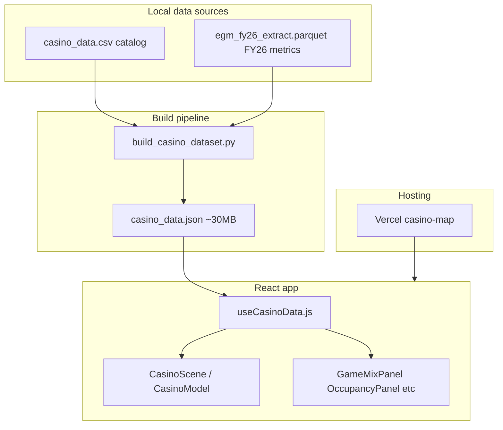

# Casino Analytics — Project Status (Claude context)

**How to use this doc:** Attach this file when starting a new Claude chat about CasinoAnalytics. Refer to section numbers for data, UI, or deploy questions.

**Last updated:** May 2026

---

## 1. Executive summary

**Casino Analytics Studio** is an interactive casino-operations workbench: a 3D floor map (React Three Fiber) plus analytics dashboards. Analysts filter by zone, day, hour, machine type, and occupancy; heat maps and side panels explain performance and occupancy drivers.

| Item | Value |
|------|--------|
| **Production** | https://casino-floormap.vercel.app |
| **GitHub** | https://github.com/laioespinheira/CasinoAnalytics (`master`) |
| **Latest shipped commit** | `8d4ea1e` — *Ship performance/occupancy UI and August-pinned game dataset for Vercel.* |

The app loads **real FY26-derived metrics** from a pre-built JSON file (not live API). Analytics dashboards still use some mock data generators for charts that are not yet wired to the full floor dataset.

---

## 2. Tech stack and commands

| Layer | Choice |
|-------|--------|
| UI | React 18, Vite 7, Tailwind 4 |
| 3D | Three.js, `@react-three/fiber`, `@react-three/drei` |
| Data build | Python 3 + `pyarrow` (`scripts/build_casino_dataset.py`) |
| Hosting | Vercel (`casino-map` project) |

```bash
npm install && npm run dev          # local app — Vite port 3000 (see vite.config.js)
npm run build:data                  # regenerate JSON (needs casino_data.csv + parquet locally)
npm run build                       # production bundle → dist/
git push origin master              # auto-deploy on Vercel (Git connected)
npm run deploy                      # CLI fallback: npx vercel --prod --yes
```

---

## 3. Architecture



- **Join key:** Parquet `Location` = CSV `machineFullName` → catalog `blender_id` maps to 3D object names in the GLB.
- **Runtime fetch:** `src/hooks/useCasinoData.js` loads `/assets/casino_data.json` (not CSV in production).
- **3D asset:** `public/models/casino_floor_map.glb` (~12 MB, committed to git).
- **Views:** `App.jsx` toggles `analytics` vs 3D; 3D modes include `overall`, `heatmap`, `comparison`, `time`.

---

## 4. Data model and build pipeline

### Output grain

Each JSON row: one machine (`blender_id`), weekday (`day`), hour (`hour`), single `game_type`, `turnover`, `stroke`, `zone`, `machineType`, etc.

### August week 1 `game_type` pin (May 2026)

Implemented in `scripts/build_casino_dataset.py`.

| Topic | Detail |
|-------|--------|
| **Problem** | Old build looped every FY game per machine → multiple `game_type` values at the same `(blender_id, day, hour)` (~343 machines). UI showed “Multiple titles this hour.” |
| **Fix** | For each machine, pick the game with **highest turnover** during **2025-08-01 … 2025-08-07** (only August year in parquet). Emit **one game per machine** in the output loop. |
| **Row count** | ~128,811 rows (was ~196,515). |
| **Metrics** | Turnover/stroke still averaged across all FY dates for that weekday, for the canonical game only. Hourly split uses CSV intraday weight shape. |
| **Zones** | Zone D, E, F merged to `Zone DD` in build. |
| **Fallback** | Machines with no August activity: top FY game by turnover, then CSV `game_type`. |

### Local-only assets (not in git)

- `public/assets/egm_fy26_extract.parquet` (~11 MB) — required for `npm run build:data`
- `photos/` — screenshots only

### Committed runtime data

- `public/assets/casino_data.json` (~30 MB) — **must be committed** for Vercel; CI does not run Python build.

---

## 5. Recent feature changes (`8d4ea1e` and related)

### 5.1 Performance panel (nav: “Performance”)

Replaces the older heatmap “Games” side panel for zone insights.

- **File:** `src/components/GameMixPanel.jsx`
- **Data:** `getPerformanceInsights(zone, filters)` in `useCasinoData.js`
- **Shows:** Area verdict, top 8 banks, top 8 game families, “pockets” (bank dominated by one family), collapsed full game title list
- **Sort:** Games ranked by **total turnover** in the filtered slice (not per-machine average)
- **Selection:** Clicking bank/family/game sets `highlightTarget` for 3D floor highlight

### 5.2 Occupancy panel

- **File:** `src/components/OccupancyPanel.jsx`
- **Data:** `getZoneOccupancy` + `occupancyDrivers` from `buildOccupancyDrivers`
- **Shows:** Zone occupancy % and “What’s driving occupancy?” (top banks and game families among **occupied** seats)

### 5.3 Panel UX

- Performance and Occupancy panels are **mutually exclusive** (`App.jsx` toggle handlers).
- `highlightTarget` shape: `{ type: 'bank' | 'family' | 'game', key, label, machineIds }`

### 5.4 3D highlight

- **Files:** `CasinoScene.jsx`, `CasinoModel.jsx`
- Non-matching machines are **dimmed** after heat-map coloring; matching machines keep heat colors.

### 5.5 Game families

- **File:** `src/utils/gameFamilies.js`
- Titles with ` - ` → family = prefix before separator (e.g. `TREE OF WEALTH - JADE ETERNITY` → `TREE OF WEALTH`)
- Titles without ` - ` → auto-cluster by first two words when ≥2 titles share prefix (GRAND STAR, LANTERN FESTIVAL, MONEY TRAILS, THUNDER JACKPOTS)
- `familyIndex` built once from catalog via `buildTwoWordFamilyIndex` in the hook

### 5.6 Machine interaction

- **Files:** `MachineTooltip.jsx`, `MachineDetailCard.jsx`, `BankHoverTooltip.jsx`
- Click/hover: turnover, occupancy, **game title**, **game family**
- After data fix: one `game_type` per machine/hour in JSON → no multi-title note in normal use
- `getMachineMetrics` still exposes `gamesAtHour` if duplicates appear in a filter slice

### 5.7 Older features still in codebase

- **Comparison mode** — period/metric toggles, `ComparisonPanel`, 3D `viewMode: 'comparison'`
- **Analytics dashboard** — `BasicDashboard`, `FloorSummaryPanel`, mock data in `src/data/casinoMockData.js`
- **Bank labels** — optional on-floor labels, outlier-only mode (`BankLabel.jsx`)

---

## 6. `useCasinoData` API reference

Hook: `src/hooks/useCasinoData.js`. Loads JSON, derives `occupancy` from turnover, memoizes `familyIndex`.

| Export | Purpose |
|--------|---------|
| `casinoData`, `loading`, `error` | Raw dataset state |
| `getFilteredData(filters)` | Rows matching zone, machine types, game, day, hour, occupancy |
| `getHeatMapData(filters)` | Per-`blender_id` turnover for heat coloring |
| `getDailyHeatMapData(filters)` | Day-level heat aggregation |
| `getBankRankings(filters)` | Bank rank within zone by avg turnover |
| `getBankTrend(filters, bankKey)` | Hourly trend buckets for a bank |
| `getZoneOccupancy(zone, filters)` | Occupancy %, drivers, machine counts |
| `getZoneGameMix(zone, filters)` | Games with `machineIds`, sorted by total turnover |
| `getPerformanceInsights(zone, filters)` | Banks, `gameFamilies`, pockets, verdict, `occupancyDrivers` |
| `getMachineMetrics(blenderId, filters)` | Single-machine slice: `gameType`, `gameFamily`, `gamesAtHour` |
| `getUniqueLocations(zone)` | Distinct bank/location labels in zone |
| `getMachinesByLocation(zone, location)` | Machines in a bank |

**Filters shape** (`App.jsx`): `{ zone, machineType[], gameType, occupancy, dayOfWeek, hourOfDay }`.

---

## 7. Deployment status

| Item | Status |
|------|--------|
| Vercel project | `casino-map` (ID `prj_4XZx8NtDCuZd40f4q4qwiUmH680w`) |
| Production URL | https://casino-floormap.vercel.app |
| Git integration | Connected: `laioespinheira/CasinoAnalytics`, production branch `master` |
| Vercel build | `npm run build` → `dist` (Vite auto-detect). **Does not** run `build:data`. |
| Local `.vercel` link | Project name in folder may show `__new_three_js_test`; same ID as `casino-map` |
| Verified prod assets | `/`, `/assets/casino_data.json`, `/models/casino_floor_map.glb` → HTTP 200 |

**Deploy workflow:** Change code and/or JSON locally → commit → `git push origin master` → Vercel builds and promotes to production.

---

## 8. Project layout

```
CasinoAnalytics/
├── docs/
│   └── PROJECT_STATUS.md          ← this file
├── public/
│   ├── assets/
│   │   ├── casino_data.json       ← runtime metrics (committed)
│   │   ├── casino_data.csv        ← machine catalog + hourly shape (build input)
│   │   └── egm_fy26_extract.parquet  ← local only
│   └── models/
│       └── casino_floor_map.glb
├── scripts/
│   └── build_casino_dataset.py
├── src/
│   ├── App.jsx                    ← views, filters, panels, highlightTarget
│   ├── hooks/
│   │   └── useCasinoData.js
│   ├── components/
│   │   ├── CasinoScene.jsx, CasinoModel.jsx
│   │   ├── GameMixPanel.jsx       ← Performance panel UI
│   │   ├── OccupancyPanel.jsx
│   │   ├── NavigationBar.jsx
│   │   ├── MachineTooltip.jsx, MachineDetailCard.jsx
│   │   ├── BasicDashboard.jsx, ComparisonPanel.jsx, …
│   └── utils/
│       ├── gameFamilies.js, format.js, analyticsEngine.js
├── package.json
└── vite.config.js                 ← dev server port 3000
```

---

## 9. Known limitations and suggested next steps

| Area | Notes |
|------|--------|
| **README drift** | Root README still mentions CSV fetch and port 5173; production uses JSON and port 3000. |
| **Large JSON in git** | ~30 MB `casino_data.json` — fine under GitHub 100 MB limit; consider Git LFS if history grows. |
| **Parquet not in repo** | Rebuild data locally after parquet/CSV changes; commit updated JSON; push. |
| **Bundle size** | Production JS ~1.6 MB minified — Vite warns; code-splitting optional. |
| **Comparison mode** | UI exists; may not be fully aligned with real FY comparison data. |
| **Mock vs real** | Some analytics dashboard charts still use `casinoMockData.js`. |

**Possible follow-ups:** Update README/deploy section, add `.vercelignore` for `photos/` and `*.parquet`, rename Vercel project slug for clarity, wire comparison mode to parquet-backed metrics, mobile polish for side panels.

---

## 10. Recent git history (context)

| Commit | Summary |
|--------|---------|
| `8d4ea1e` | Performance/occupancy UI, August-pinned dataset, game families |
| `1bb61f1` | Analytics dashboard reorg, heatmap UX |
| `5dee330` | Comparison mode UI |
| `0e042fe` | Machine detail card metrics, page title |

---

## 11. Discussion prompts for Claude

Use these when planning next work:

1. **Data:** Change canonical game window (not only August week 1)? Re-aggregate turnover by month?
2. **UI:** Merge Performance + Occupancy into one panel? Expand “pockets” copy for executives?
3. **3D:** Highlight by occupancy vs turnover? Bank-level click to filter?
4. **Deploy:** Split JSON to CDN / lazy-load? Add `build:data` to CI with cached parquet?
5. **Quality:** Tests for `gameFamilies.js` and `getPerformanceInsights` edge cases?
